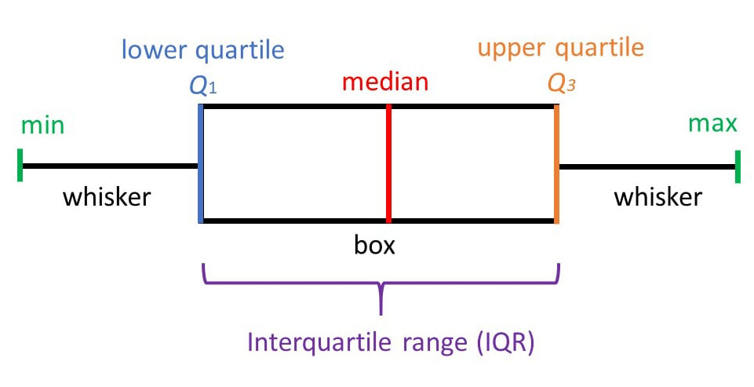

## Creating histograms
- Arrange data points in ascending order
- Calculate range = Max value - Min value
- Decide number of classes for histogram (number of groups)
- Calculate class width = Range / Number of classes (Round up if needed)
- Determine groups:
    - Group1: Min Val to (MinVal + Class Width)
    - Group 2: Group1 Upper Val to (Group1 Upper Val+ Class Width)
    - …

## Whisker Plots


## Density Curves
- The area under a density curve will always represent 100 % of the data, or 1.0 
- The curve will never dip below the x-axis. 

## QQ Plot (Quantile-Quantile Plot)
- Used to determine whether a data set is distributed in a certain way 
- Unless otherwise specified, it usually showcases how the data fits a normal distribution
- The Y-axis shows the values and the X-axis shows ==**Theoretical Quantiles**==
- The diagonal line represnts the normal distribution

*[Theoretical Quantiles]: The number of standard deviations the values are away from the mean

!!! abstract "Sample Code"
    [Colab Link](https://colab.research.google.com/drive/1DBoFlqtpY1jBBz2mZRoac2KlQeNLpT3C#scrollTo=ccb397a7-f5dd-4fea-bc62-9f7febf02877)

    [Probplot](https://docs.scipy.org/doc/scipy/reference/generated/scipy.stats.probplot.html#scipy.stats.probplot)

    ```python
    import scipy.stats as stats
    import pylab

    # first parameter is the data to plot
    # second parameter is the type of plot
    stats.probplot(df_ts_base1.spx, plot = pylab)
    pylab.show()
    ```

## Trendline
- Scatterplot with line indicating the trend
- Since this is a scatterplot, date values will not work in the x axis
    - We need to use numeric values (e.g. indices) instead
- Can be linear or polynomial

!!! abstract "Sample Code"
    [Colab Link](https://colab.research.google.com/drive/1DBoFlqtpY1jBBz2mZRoac2KlQeNLpT3C#scrollTo=d327ffbf-f092-43b3-bbe1-567bc28ca6fe)

    [Regplot](https://seaborn.pydata.org/generated/seaborn.regplot.html)

    ```python
    import seaborn as sns

    # Linear Trendline
    sns.regplot(x = df_ts_2.index.values, y=df_ts_2.spx)

    # Polynomial Trendline
    # use the order parameter to generate polynomial trendlines
    # default is order =1 and plots a linear trendline
    sns.regplot(x = df_ts_2.index.values, y=df_ts_2.spx, order=2)
    ```

## Lag PLots
- Used to understand the effect of lag periods on current value

!!! abstract "Sample Code"
    [Colab Link](https://colab.research.google.com/drive/1DBoFlqtpY1jBBz2mZRoac2KlQeNLpT3C#scrollTo=d688b7a3-7de1-42f0-af30-cbaecc757d67)

    [Lag_Plot](https://pandas.pydata.org/docs/reference/api/pandas.plotting.lag_plot.html)

    ```python
    # Helps analyze correlation w.r.t a single lag period
    from pandas.plotting import lag_plot
    lag_plot(df_ts_3.spx)
    ```

## Autocorrelation PLots
- Can be used to analyze correlation w.r.t. all previous periods

!!! abstract "Sample Code"
    [Colab Link](https://colab.research.google.com/drive/1DBoFlqtpY1jBBz2mZRoac2KlQeNLpT3C#scrollTo=c7a9958d-23d0-4c13-b9ea-6f1f8416b5bf)

    [Autocorrelation_Plot](https://pandas.pydata.org/docs/reference/api/pandas.plotting.autocorrelation_plot.html)

    ```python
    from pandas.plotting import autocorrelation_plot
    autocorrelation_plot(df_ts_3.spx)
    ```